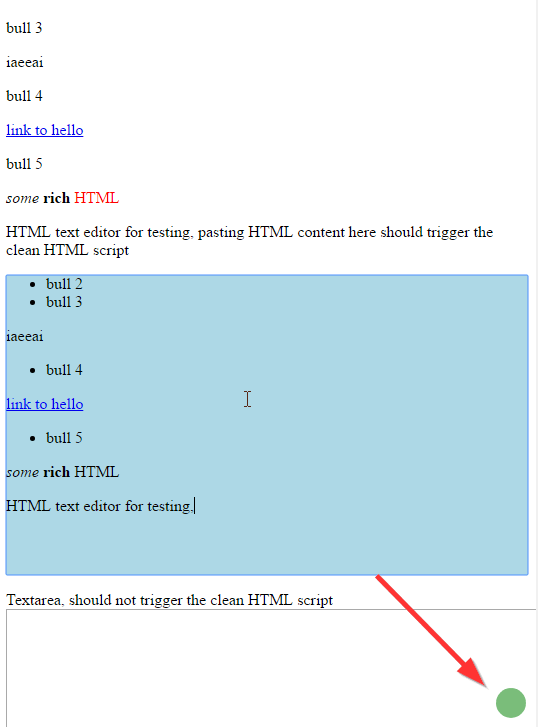

# clean-html-userscript

A JS tool intended to be used as userscript to clean up HTML in a rich text editor in the browser

## Features

* Removes all style attributes from elements and all other unwanted attributes
* Replaces non breaking spaces with normal spaces
* Normalizes some custom Word and LibreOffice Writer formattings (e.g. for unordered lists) to proper HTML

## Limitations

* Currently only works with the TYPO3 rich text editor.

## Setup

### Chrome users

1. Install the [Tampermonkey](https://chrome.google.com/webstore/detail/tampermonkey/dhdgffkkebhmkfjojejmpbldmpobfkfo?hl=en) extension
2. Click on the Tampermonkey extension icon on the right of the browser address bar, then on _Dashboard_.
3. Click on the script icon with the green plus sign to create a new script.
4. Paste the contents from [bundle.js](https://github.com/TomOne/clean-html-userscript/raw/master/dist/bundle.js) into the script editor, replacing all previous contents.
5. Hit the save button

To update the userscript, follow step 2, then click on the edit icon with the pencil replace the old script with [bundle.js](https://github.com/TomOne/clean-html-userscript/raw/master/dist/bundle.js).

### Firefox users

Coming soon

## Usage

Just copy the desired content into the rich text editor as you would normally do. The script automatically detects if the clipboard contains HTML content and transparently performs the cleaup in these cases. No special interaction by the user such as keyboard shortcuts are required.

A notification in form of a green circle in the bottom right corner of the viewport will appear as soon as the cleanup is performed, see screenshot:

## Browser support

Modern browsers such as Chrome 55+ and Firefox 51+. Other browsers are untested.

## Development

1. Clone this repository
2. Run `npm install` in this directory
3. Run `npm run build` to generate the script bundle ([bundle.js](https://github.com/TomOne/clean-html-userscript/raw/master/dist/bundle.js)) from the source or alternatively `npm run watch` to incrementally build it on every change.
